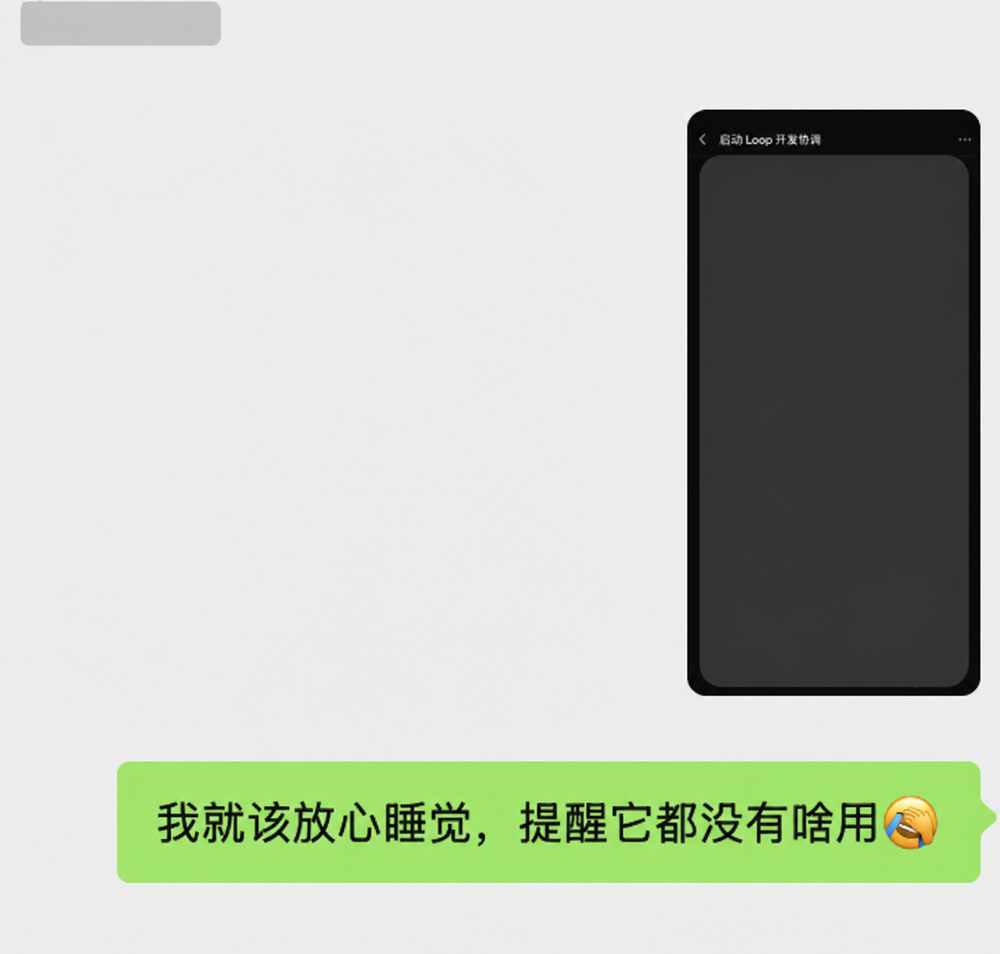

# General Loop

**A file-native coordination loop for long-running AI work.**

[中文 README](README.zh-CN.md) · [Official case study](https://shennian.net/blog/general-loop) · [Source and license](SOURCE.md) · [MIT License](LICENSE)

General Loop turns a folder of Markdown tasks into the shared coordination surface for one Loop Agent, many execution Agents, and the people working with them. It is a protocol and a set of prompts—not a new agent runtime or cloud service.

The name joins the same open-source family as [GeneralAgent](https://github.com/CosmosShadow/GeneralAgent), while remaining independent from that runtime.

The project grew out of a real, multi-day software release in which one Loop coordinated development, testing, signing, multi-platform builds, deployment, quota failures, and human decisions without requiring a person to keep every conversation moving by hand.

## Why a Loop

One agent conversation works well for one bounded task. Large projects are different:

- requirements, bugs, investigations, tests, and releases run at the same time;
- multiple Agents can edit the same files or test against the same candidate;
- simulators, devices, accounts, signing services, and release windows are shared resources;
- a finished implementation still needs independent verification and sometimes release approval;
- provider quotas and long-running commands fail at inconvenient times;
- if a person must repeatedly open every conversation, ask for status, and decide the next prompt, that person becomes the outer loop.

General Loop moves that outer loop into an Agent that can be woken periodically, inspect real execution, coordinate the next action, and write the result back to the project.


## The four parts

1. **Loop Agent** — can use tools, inspect or start other Agent sessions, and be woken by a native or external schedule.
2. **Task Markdown library** — the durable, human-readable interface shared by every participant.
3. **Execution Agents** — developers, investigators, testers, release operators, support Agents, or any other role your project needs.
4. **People** — can talk to the Loop or any other Agent. The current Agent writes confirmed requirements, decisions, progress, and evidence into the Task.

The Loop and execution Agents both read and update Tasks. The Task library is not a private queue owned by the Loop.

## How it runs

On each wake-up, the Loop:

1. scans active Tasks;
2. checks the real status of referenced Agent sessions and shared resources;
3. decides whether to wait, continue, clarify, dispatch, verify, unblock, or close;
4. performs the smallest useful action within existing authority;
5. writes facts, evidence, ownership, and the next action back to the Task;
6. reports meaningful changes and stays quiet when nothing changed.

The schedule is a wake-up mechanism, not the intelligence of the system. The Loop Agent still makes the project-specific judgment.

## Add it in two minutes

Give this first prompt to the AI working in your project. It configures the protocol without forcing the current conversation to become the Loop:

```text
Read the official General Loop guide (https://shennian.net/blog/general-loop)
and open-source project (https://github.com/CosmosShadow/general-loop), then add
General Loop to this project. Use README.md and tasks/template.md and configure
the required AGENTS.md, agents/, and tasks/ for the current project structure.
When configuration is complete, ask whether I want this conversation to become
the project's only Loop and begin coordination now. If cross-AI execution is
needed, explain why and ask before using https://shennian.net/install.md and
https://shennian.net/skill.md to add Shennian.
```

Then send the second prompt to start that conversation as the Loop:

```text
Yes. Make this conversation the project's only Loop and begin coordinating all
existing Tasks now. Prefer the host's native recurring task to wake every 5
minutes. If the host has no scheduler but this conversation can safely wait and
resume, wait 5 minutes after each complete coordination cycle and continue until
I explicitly pause it or every Task is terminal. Stay quiet when nothing changes,
and explain that an external wake-up mechanism is required if persistent waiting
is unsupported.
```

You can also copy `AGENTS.md`, `agents/`, and `tasks/` manually. Codex can use its native task/thread and automation capabilities; no additional service is required for the core workflow. See [Codex setup](docs/codex.md).

## Task example

Task filenames remain useful during a plain directory scan:

```text
YYYYMMDD-HHmm_short-title_current-status.md
```

The minimum Task records the objective, acceptance criteria, Handler, execution reference, facts, evidence, result, and next action. Start from [the template](tasks/template.md).

## Humans can enter anywhere

A person can talk directly to the Loop, or start a separate Agent conversation to discuss or implement a Task. The Agent in that conversation becomes the current Handler, records the conversation's confirmed outcome in the Task, and keeps coordination authority explicit. This prevents the Loop from starting duplicate work or taking over a person-directed conversation.

## A real result

In the first large-project run, the Loop detected a provider quota failure, switched the unfinished work to an available Agent, preserved release gates while avoiding pointless waiting, invalidated evidence that referred to an old candidate, and kept a whole-project progress board current. A person noticed the quota issue and sent a warning—then discovered the Loop had already handled it.



## Native first; Shennian is optional

General Loop uses the host's native Agent and scheduling tools when they are sufficient. If you need to start, observe, continue, or stop a different local AI tool, the optional [Shennian integration](integrations/shennian.md) provides a cross-AI execution layer.

Shennian is not required by the core protocol and is never installed or enabled automatically. Use the [official website](https://shennian.net), [Client installation guide](https://shennian.net/install.md), and [Skill installation guide](https://shennian.net/skill.md) when you choose to enable it.

## Data boundary

The General Loop core stores its coordination records as local project files and does not require a General Loop server. That does **not** mean all model data stays on the machine: Codex, Claude Code, other AI providers, Git hosting, and optional integrations each retain their own data boundaries.

The current Shennian integration is local-first, not a promise of local-only or zero transmission. See its official documentation before enabling it.

## How it differs from nearby projects

| Project | Primary shape | General Loop's different focus |
|---|---|---|
| [LoopX](https://github.com/loopx-project/loopx) | CLI, state kernel, goals, gates, claims, leases, quota, adapters | No dedicated runtime or private state model; Tasks remain ordinary Markdown |
| [Ralph Loop](https://github.com/Yeine/ralph) | Repeated fresh coding-agent iterations driven by a prompt/task file | Continuous project-level coordination across roles, conversations, and shared resources |
| [AgentLoop](https://github.com/Guri10/AgentLoop) | Plan → execute → observe → update control-loop implementation | Cross-conversation project coordination rather than a single autonomous controller |
| [Athena Loops](https://github.com/luckeyfaraday/athena-loops) | Deterministic orchestrator → worker → reviewer Python harness | Agent-led coordination whose shared contract is the repository's Task documents |
| [Agentic Loop](https://github.com/bartoszarendt/agenticloop) | Markdown-first supervised work-unit protocol | Periodic project-wide coordination and live execution/resource observation |

General Loop does not claim that file memory, human gates, schedulers, or multi-agent roles are new individually. Its contribution is a small, copyable combination that makes the Task document the shared interface for the person, the coordinator, and every executor—and has been exercised on a real large project.

## Repository layout

```text
general-loop/
├── AGENTS.md
├── CLAUDE.md
├── agents/
│   ├── loop.md
│   ├── developer.md
│   ├── qa.md
│   ├── release.md
│   └── support.md
├── tasks/
│   ├── README.md
│   ├── template.md
│   └── example-task.md
├── docs/
│   ├── codex.md
│   ├── claude-code.md
│   └── other-agents.md
└── integrations/
    └── shennian.md
```

## Status

This is the first public version of the protocol, extracted from a working project. It intentionally begins as readable files rather than a framework. Feedback and real-world Task examples are welcome, but remove private names, paths, credentials, and internal execution references before sharing.

## License

[MIT](LICENSE). You may freely use, copy, modify, and redistribute General Loop under the license terms. Keep [SOURCE.md](SOURCE.md), the license, or an equivalent upstream reference with copied templates so future readers can find the original project and current documentation.
