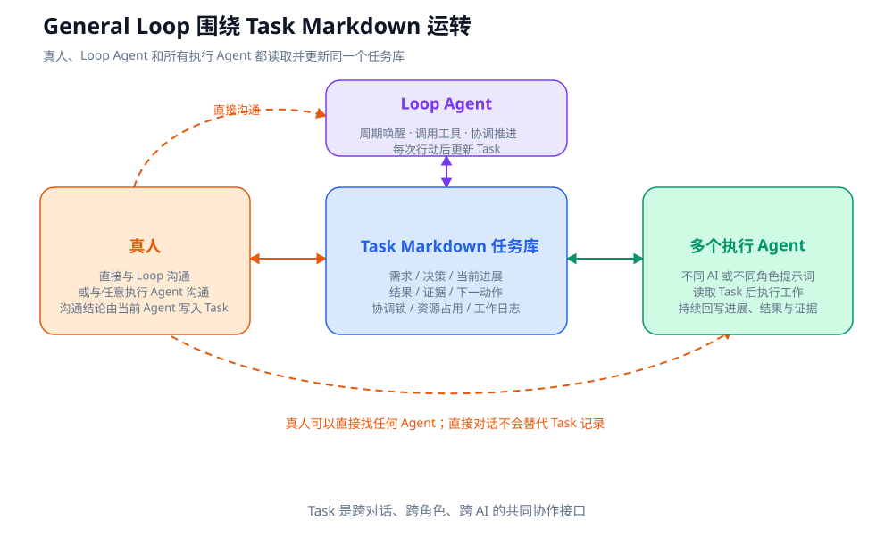

# General Loop

**面向长期 AI 工作的文件原生协调循环。**

[English README](README.md) · [官方案例与图解](https://shennian.net/blog/general-loop) · [来源与授权](SOURCE.md) · [MIT 协议](LICENSE)

General Loop 把一组 Markdown Task 变成一个 Loop Agent、多个执行 Agent 和真人共同使用的协调界面。它是一套协议、角色提示词和模板，不是新的 Agent Runtime，也不要求使用专用云服务。

## 为什么需要 Loop

一个 Agent 对话适合完成一个边界清楚的任务。大型项目同时包含需求、Bug、调查、测试、发布和外部等待，多个 Agent 还会争用文件、候选、设备、账号与发布窗口。如果人必须不断打开每个对话、追问状态、复制上下文和发送下一条指令，人就会成为整个 AI 团队的串行瓶颈。

Loop 承担 AI 团队的项目经理职责：周期醒来，读取全部 Task，检查真实执行，协调并发与共享资源，处理阻塞并把结果写回。人负责提出需求、做必要决策、授权高风险动作和完成关键验收，不再需要全程盯住每个对话。

## 四个组成部分

1. **Loop Agent**：能使用工具、读写 Task、观察或启动其他 Agent，并被周期唤醒。
2. **Task Markdown 任务库**：真人、Loop 和所有执行 Agent 的共同接口。
3. **执行 Agent**：开发、调查、测试、发布、支持或其他项目需要的角色。
4. **真人**：可以找 Loop，也可以从任何 AI 对话进入；当前 Agent 把确认的信息写回 Task。



## 2 分钟接入

先把这句话交给当前项目中的 AI。它只完成配置，不会强制当前对话立即成为 Loop：

```text
请阅读 General Loop 官方介绍（https://shennian.net/blog/general-loop）和开源项目（https://github.com/CosmosShadow/general-loop），在当前项目中接入 General Loop；优先使用仓库中的中文说明与中文模板 README.zh-CN.md、tasks/template.zh-CN.md，根据当前项目结构配置所需的 AGENTS.md、agents/ 与 tasks/；配置完成后，请询问我是否要把当前对话设为项目唯一的 Loop 并立即开始协调；如需跨 AI 调起，请先向我说明，并询问是否按 https://shennian.net/install.md 和 https://shennian.net/skill.md 接入神念。
```

然后发送第二句话，确认让当前对话立即运行 Loop：

```text
是，请把当前对话设为项目唯一的 Loop 并立即协调现有的全部 Task；优先使用宿主原生周期任务每 5 分钟唤醒，如宿主没有周期任务但支持当前对话持续等待与恢复，则每轮协调结束后等待 5 分钟再继续，直到我明确暂停或所有 Task 终结；没有变化时保持静默，不支持持续等待时说明需要外部唤醒机制。
```

完整 Task 中文模板见 [`tasks/template.zh-CN.md`](tasks/template.zh-CN.md)。Codex、Claude Code 和其他宿主的说明见 [`docs/`](docs/)。

## 每轮如何运行

每次醒来后，Loop：

1. 扫描所有未终结 Task；
2. 通过执行引用核验 Agent 对话和命令是否仍在真实运行；
3. 识别依赖、候选漂移、陈旧证据、资源冲突和可并行工作；
4. 决定等待、续发、纠偏、分派、测试、发布、停止或收口；
5. 执行当前授权内最小必要动作；
6. 把事实、证据、Handler 和下一动作写回 Task；
7. 有变化才汇报，没有变化保持静默。

周期任务只负责叫醒 Loop，项目判断仍由 Loop Agent 完成。没有原生周期任务时，只有在宿主确实支持当前对话持续等待和恢复的情况下，才能在每轮结束后等待 5 分钟继续；否则需要外部唤醒机制。

## 真人可以从任何对话进入

真人可以直接找 Loop，也可以新开一个 Agent 对话讨论或实施 Task。这个对话中的 Agent 成为当前 Handler，把确认的需求、决策、进度和证据写回 Task。Loop 可以核验与汇报，但不能重复分派、抢占资源或擅自接管真人直管工作。

## 原生优先，神念可选

宿主自己的 Agent 与周期任务能力足够时，不需要额外服务。如果 Loop 需要调起和跟进当前宿主无法原生管理的 Claude Code、Qwen Code 或其他 AI，可以选择神念作为跨 AI 执行层：

- 神念官网：<https://shennian.net>
- Shennian Client 安装：<https://shennian.net/install.md>
- Shennian Skill 安装：<https://shennian.net/skill.md>

神念不是 Loop，也不是 Task 数据库；核心协议不会自动安装或启用它。神念解决跨 AI 调起与跟进，不会替所有 AI 宿主凭空增加原生定时任务。

## 数据边界

General Loop 自身把协调记录保存在项目文件中，不需要 General Loop 服务器。这不等于所有模型数据都留在本机：Codex、Claude Code、其他模型服务、Git 托管和可选集成都有各自的数据边界。神念当前是 local-first，不是 local-only 或零传输承诺。

## 仓库结构

```text
general-loop/
├── AGENTS.md
├── CLAUDE.md
├── agents/
├── tasks/
│   ├── template.md
│   └── template.zh-CN.md
├── docs/
└── integrations/shennian.md
```

## 来源与协议

- 开源项目：<https://github.com/CosmosShadow/general-loop>
- 官方案例：<https://shennian.net/blog/general-loop>
- 协议：[MIT](LICENSE)

你可以依照 MIT 协议自由使用、复制、修改、合并、发布和分发。复制模板时请保留 `SOURCE.md`、LICENSE 或等价的上游链接，让后来的人能够找到原始项目、当前文档与更新。
